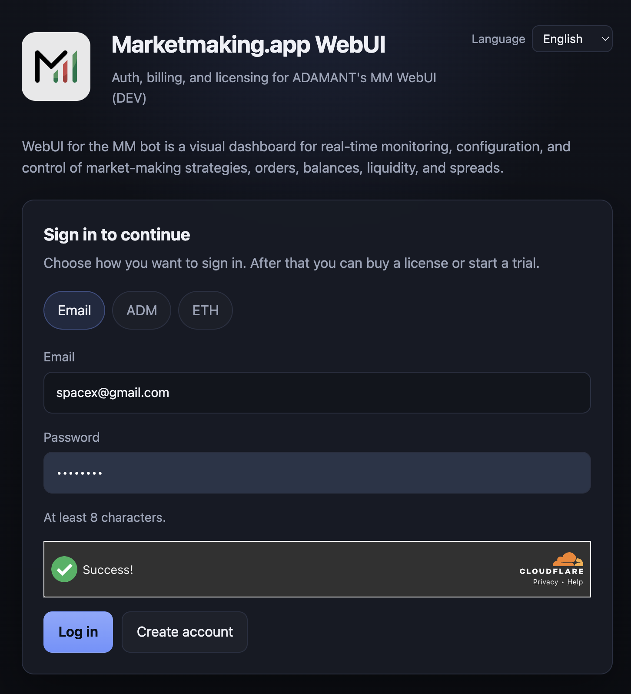
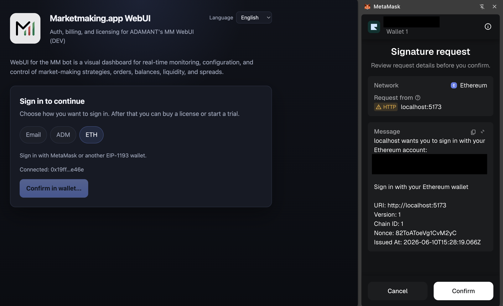
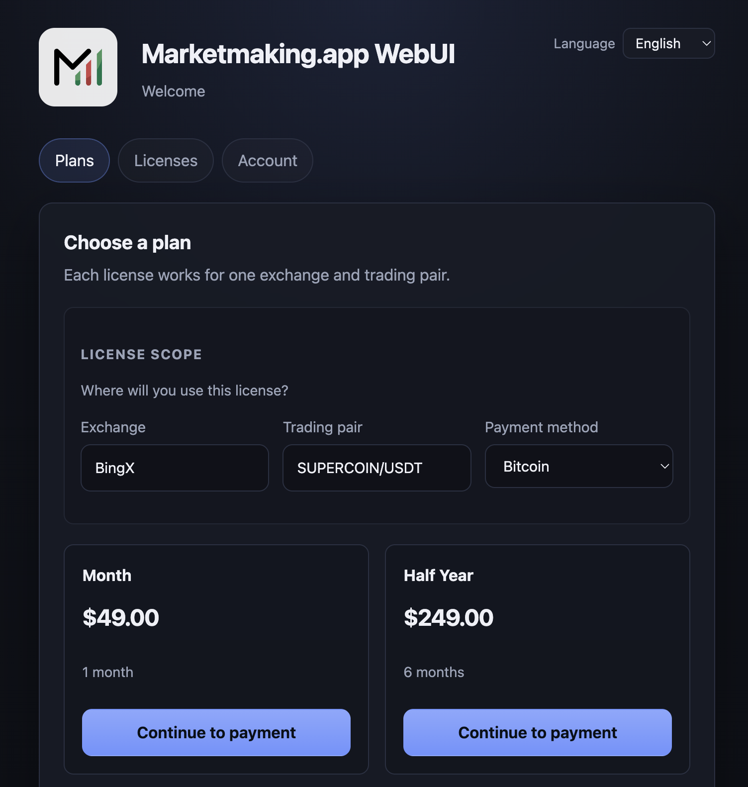
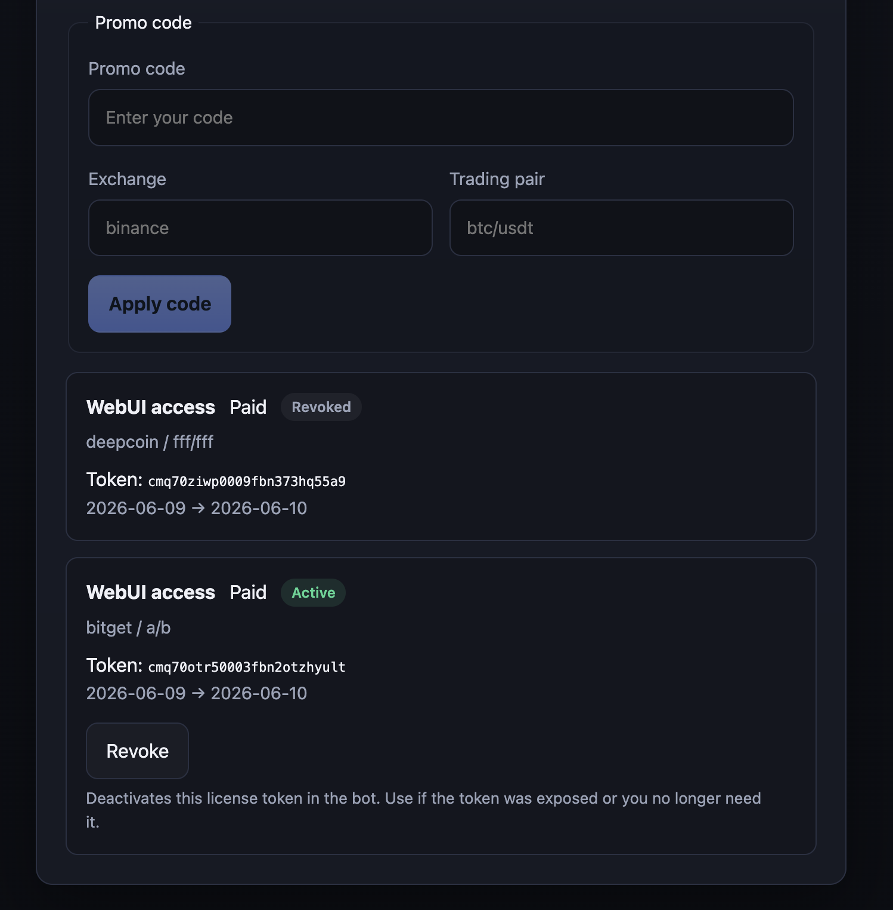
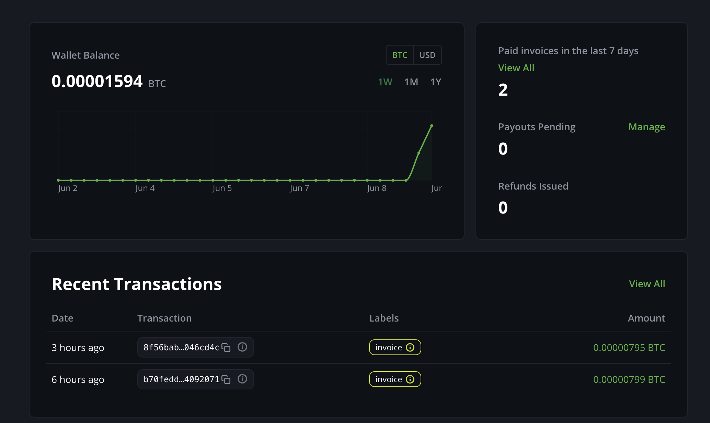
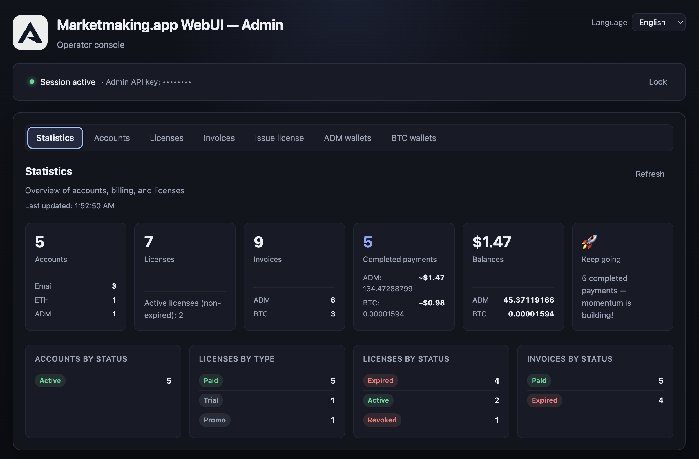
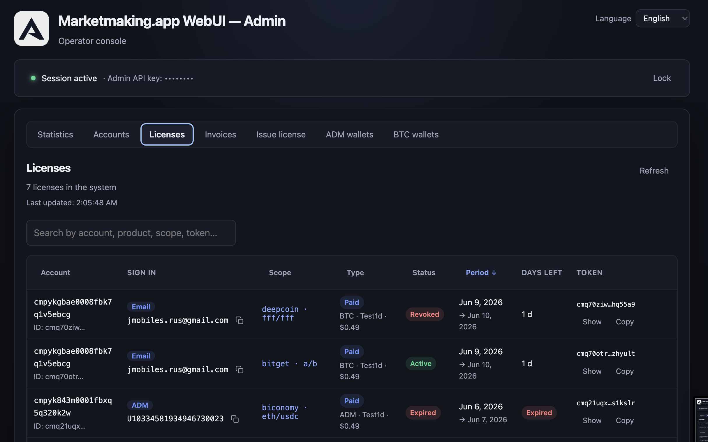
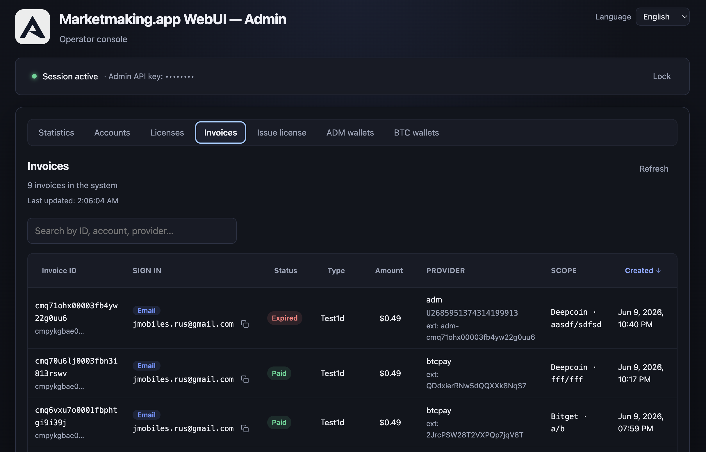

# ADAMANT Payment

[](https://adamant.im/donate/)

**Universal crypto-first platform for payments, subscriptions and software license management.**

ADAMANT Payment (`adamant-payment`) is a self-hostable platform that combines authentication, billing, crypto payments, subscriptions, license management, a customer portal, and an operator admin console — in one product-neutral solution.

No need to stitch together Stripe, a licensing SaaS, and custom auth. Built for Web3 projects, trading bots, desktop apps, and SaaS products that sell to a global audience and accept **Bitcoin**, **ADAMANT**, and other cryptocurrencies.

> **Note:** This repository is the public home for the project overview, roadmap, and community discussion. The application source code is maintained in a private repository and is not open source.

**Interested in using ADAMANT Payment?** [Contact us](https://adamant.business/contact/)

Related: [Community discussion](https://github.com/orgs/Adamant-im/discussions/47) · [Release tracking (#1)](https://github.com/Adamant-im/adamant-payment/issues/1)

---

## Why ADAMANT Payment

### Crypto-first by design

Cryptocurrency payments are a first-class feature — not a bolt-on. BTCPay Server (BTC), ADM-native on-chain deposits, and extensible payment providers fit naturally into checkout and settlement flows.

### All-in-one platform

Auth, billing, payments, subscriptions, license management, user portal, and admin panel in one stack. One deployment, one data store, one integration surface for your product.

### Built-in licensing for software

Licenses are issued automatically after payment. Manage expiration, plans, trials, and promo codes. External apps — bots, relays, desktop clients — validate access through a dedicated API.

### Flexible sign-in: email or crypto-only

Users sign in with **email + password**, **ADM message code**, or **Ethereum wallet (SIWE)**. Web3-friendly flows without mandatory email identity.

### Included frontend and admin panel

Customers manage payments, licenses, and subscriptions. Operators manage accounts, orders, plans, wallets, and access rights from a separate admin console.

### Universal and product-independent

Not tied to ADAMANT Messenger or any single app. White-label branding via environment configuration. Generic product slugs in the data model.

### API-first architecture

REST API under `/v1/...` for bots, SaaS backends, relays, and desktop applications. Check license status, subscription validity, and user access programmatically.

### Self-host friendly and data-controlled

Deploy on your own infrastructure (PostgreSQL, Node.js). Full control over users, payment logic, licenses, and business data.

### No dependence on closed platforms

Unlike Stripe, Paddle, Lemon Squeezy, or traditional licensing SaaS, ADAMANT Payment adapts to your crypto payment flows, pricing models, and product rules.

### Security built in

Separate user and admin surfaces, protected authentication, secure license validation APIs, optional **ADM 2FA** and **ETH 2FA** for operators, captcha, rate lockout, and audit logging.

---

## User portal

Sign in with email, ADM, or Ethereum wallet. Browse plans, pay with crypto, and manage scoped licenses.



*Sign-in screen: email, ADM message code, or Ethereum (SIWE) wallet authentication.*



*Ethereum sign-in via SIWE — connect wallet and sign a challenge message.*



*Product catalog with configurable paid plans and exchange / trading-pair scope.*



*Customer view: active licenses, trial claims, and subscription status.*



*Crypto checkout via BTCPay Server — BTC invoice linked to license issuance.*

---

## Operator admin console

Full operator dashboard for accounts, licenses, invoices, and payment wallets. Deploy on a separate origin in production.



*Admin dashboard: revenue metrics, license counts, and ADM/BTC wallet balances.*



*Operator license list with filters, manual issuance, and payment metadata.*



*Paid and pending invoices across accounts and payment providers.*

---

## Use cases

| Scenario | Description |
| -------- | ----------- |
| **SaaS / bot subscription** | User registers, pays in crypto, receives a license token; your app validates access via API |
| **Trading bot WebUI (scenario B)** | Customer buys subscription on ADAMANT Payment; bot connects outbound to a public WebUI relay |
| **Trial → paid conversion** | Time-limited trial per product scope; upgrade through checkout extends or replaces the license |
| **White-label product** | Rebrand UI and API responses for your product; same core platform |
| **Self-hosted monetization** | Run billing on your VPS; no third-party holds your customer or payment data |

First production integration: **ADAMANT Tradebot WebUI subscription** ([adamant-tradebot](https://github.com/Adamant-im/adamant-tradebot)).

---

## v1.0 highlights

| Area | Included in v1.0 |
| ---- | ---------------- |
| **Auth** | ADM code, Ethereum (SIWE), email + password; JWT + refresh cookies; Turnstile captcha |
| **Billing** | Catalog, trial (14 days), paid / promo / manual licenses; hot-reload plan and promo config |
| **Payments** | BTCPay Server (BTC), ADM-native (unique deposit address + watcher), dev provider |
| **Admin** | Stats, accounts, licenses, invoices, ADM/BTC wallets; API key + optional 2FA; en/ru i18n |
| **Web** | Sign-in, catalog, checkout, license management; en/ru i18n; branding |
| **CI** | GitHub Actions — build, lint, typecheck |

Full scope and release checklist: [Issue #1](https://github.com/Adamant-im/adamant-payment/issues/1).

---

## Contact

Planning to integrate ADAMANT Payment into your product, bot, or SaaS?

**[Get in touch → adamant.business/contact](https://adamant.business/contact/)**

We welcome feedback on payment providers, licensing models, and integration scenarios in the [community discussion](https://github.com/orgs/Adamant-im/discussions/47).

---

## Technical overview

<details>
<summary><strong>Architecture and stack</strong> (for developers)</summary>

### Monorepo layout

```text
adamant-payment/
├── apps/
│   ├── api/          # Fastify 5 + Prisma + PostgreSQL — source of truth
│   ├── web/          # End-user UI (login, plans, checkout, licenses)
│   └── admin/        # Operator UI (separate deploy / IP allowlist)
├── packages/
│   └── shared/       # Zod schemas, types, API client, i18n
└── config/           # Hot-reloaded paid plans, promo codes, exchanges
```

### Stack

| Layer | Technology |
| ----- | ---------- |
| Runtime | Node.js ≥ 20.19 |
| Monorepo | pnpm workspaces + Turborepo |
| API | Fastify 5, TypeScript, Prisma, PostgreSQL |
| Frontends | Vite + React 18 (web and admin as separate apps) |
| Shared | Zod validation, typed API client, i18n (en / ru) |

### Core data model

- **Account** + **AuthIdentity** (`adm` | `eth` | `email`)
- **Product**, **Plan**, **Price**, **Subscription**, **Invoice**, **Payment**
- **License** — scoped token (`trial` | `paid` | `promo` | `manual`); optional `exchange` + `pair` scope
- Pluggable **PaymentProvider** — BTCPay, ADM-native, dev (local simulate)

### API conventions

- JSON REST under `/v1/...`
- Health: `GET /health`
- Auth: JWT access + httpOnly refresh cookie
- Errors: `{ "error": "CODE", "message": "..." }`
- License validation endpoint for relays and external products

### Platform integration (ADAMANT Tradebot)

| Repo | Role |
| ---- | ---- |
| **adamant-payment** | Auth, billing, payments, license validation |
| **adamant-tradebot** | Bot REST/WS API |
| **adamant-tradebot-webui** | Public WebUI + relay (socket.io tunnel) |

**Scenario A:** Self-hosted WebUI — browser talks to bot API directly.

**Scenario B:** User buys on ADAMANT Payment → license in bot config → bot connects outbound to relay → browser uses public WebUI.

### Design principles

1. **Security** — no secrets in logs; Zod input validation; idempotent webhooks
2. **Correctness** — license scope enforced on issue and validate; trial once per scope globally
3. **Neutrality** — no hardcoded product names in DB enums; configurable branding
4. **Self-host** — Docker Compose for Postgres; no mandatory cloud dependencies

### Post-v1 roadmap

- Subscription renewal automation
- Additional payment providers and chains
- OpenAPI documentation
- Third-party product integrations beyond Tradebot

</details>

---

## License

Proprietary — closed source. Contact [adamant.business](https://adamant.business/contact/) for licensing and deployment inquiries.
